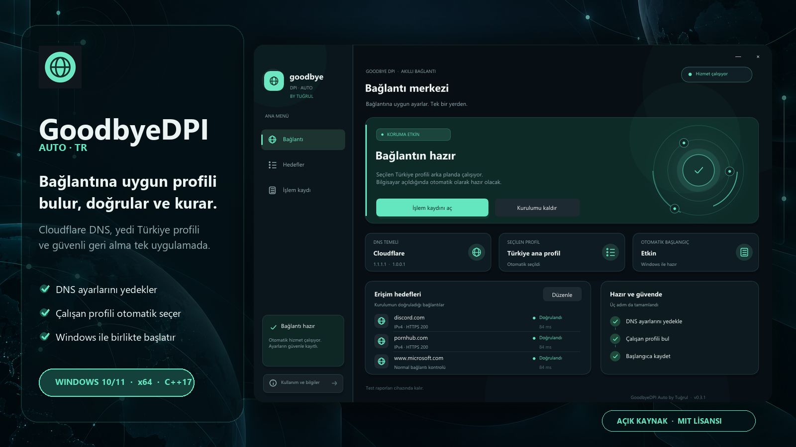
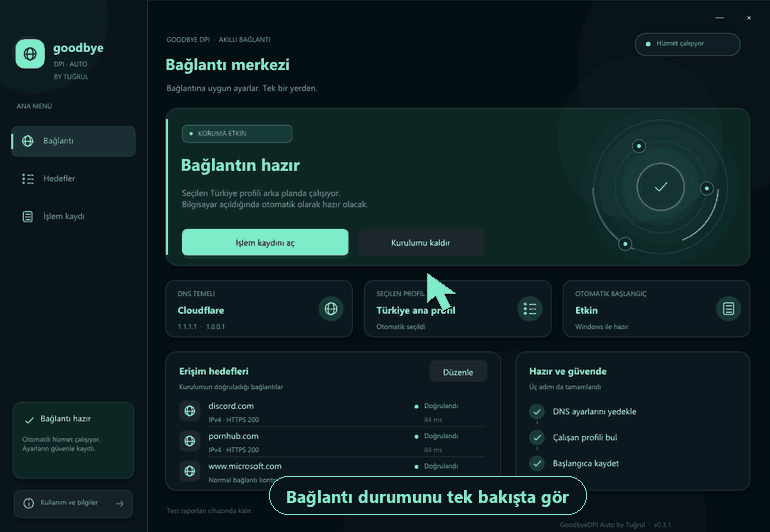
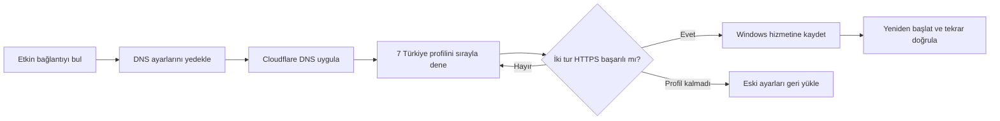
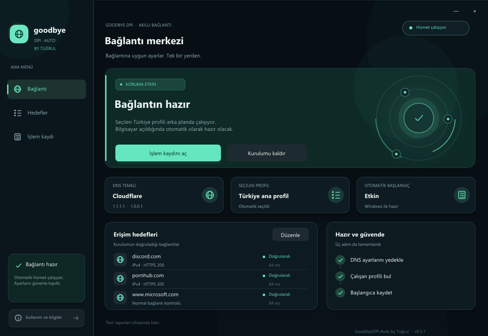
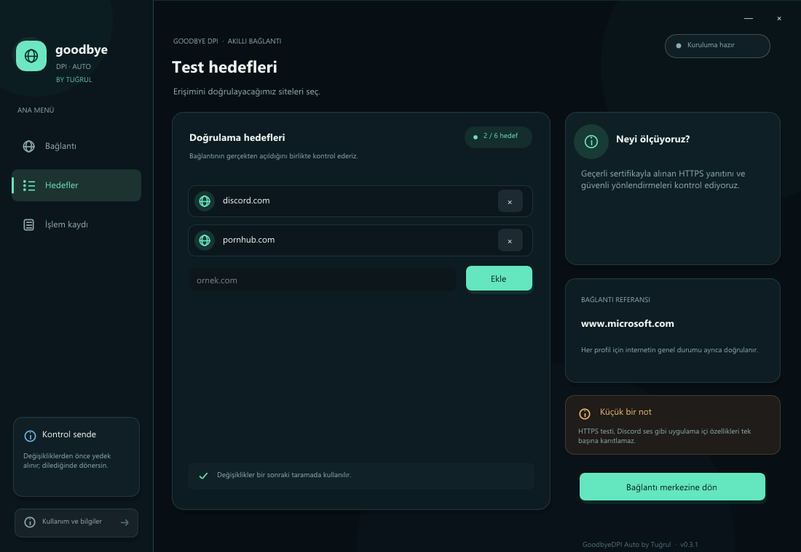
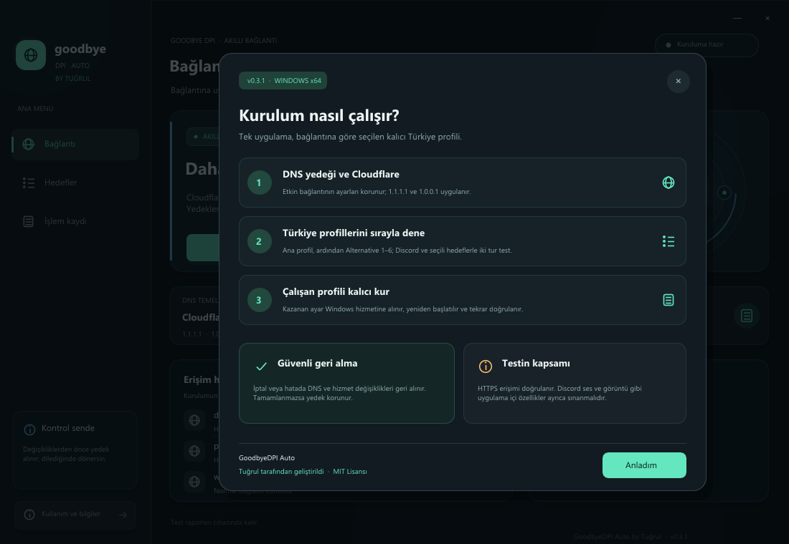

<p align="center">
  
</p>

<h1 align="center">GoodbyeDPI Auto TR</h1>

<p align="center">
  Bağlantına uygun GoodbyeDPI profilini bulan, doğrulayan ve Windows hizmeti olarak kuran<br />
  açık kaynaklı C++ / Dear ImGui masaüstü uygulaması.
</p>

<p align="center">
  <a href="../../actions/workflows/windows-build.yml"></a>
  <a href="../../releases/latest"></a>
  <a href="./LICENSE.txt"></a>
  
  
</p>

<p align="center">
  <a href="https://github.com/Hytreux/GoodbyeDPI-Auto-TR/releases/latest/download/GoodbyeDPI-Auto.exe"><strong>⬇️ Windows için indir</strong></a>
  &nbsp;&nbsp;•&nbsp;&nbsp;
  <a href="./KULLANIM.md">Kullanım rehberi</a>
  &nbsp;&nbsp;•&nbsp;&nbsp;
  <a href="./Test-Sonuclari.txt">Test sonuçları</a>
</p>

> [!IMPORTANT]
> Uygulama Windows 10/11 **x64** içindir ve kurulum işlemi yönetici izni gerektirir. Proje GoodbyeDPI, WinDivert veya Cloudflare'ın resmî uygulaması değildir.

## Tek uygulama, otomatik profil seçimi

GoodbyeDPI Auto etkin bağlantıyı inceler, DNS ayarlarını güvenli biçimde yedekler ve GoodbyeDPI-Turkey paketindeki yedi profili sırayla sınar. Seçtiğiniz hedefler iki ardışık turda başarılı olduğunda çalışan profil Windows hizmeti olarak kaydedilir ve bilgisayar açıldığında otomatik başlar.

<p align="center">
  
</p>

| | Özellik | Ne yapar? |
|:--:|---|---|
| 🛡️ | **Güvenli DNS yedeği** | Etkin bağlantının IPv4 ve kullanılabilir IPv6 DNS ayarlarını ayrı ayrı saklar. |
| ⚡ | **Otomatik profil taraması** | Türkiye ana profili ve altı alternatifi belirlenen sırayla dener. |
| ✅ | **Kararlı doğrulama** | Seçili hedeflerin ve normal bağlantı kontrolünün iki tur geçmesini ister. |
| 🚀 | **Otomatik başlangıç** | Kazanan profili Windows ile başlayan kalıcı bir hizmete dönüştürür. |
| ↩️ | **Güvenli geri alma** | İptal veya hatada hizmeti kaldırıp önceki DNS ayarlarını geri yüklemeyi dener. |
| 🔒 | **Dosya doğrulama** | Gömülü motor, DLL ve sürücüyü sabit SHA-256 değerleriyle denetler. |

## Nasıl çalışır?



Profil doğrulaması şu sırada yapılır:

1. **Türkiye ana profil:** `-5 --set-ttl 5` ve paket DNS yönlendirmesi
2. **Alternative 1:** `--set-ttl 3`
3. **Alternative 2:** `-5`
4. **Alternative 3:** `--set-ttl 3` ve paket DNS yönlendirmesi
5. **Alternative 4:** `-5` ve paket DNS yönlendirmesi
6. **Alternative 5:** `-9` ve paket DNS yönlendirmesi
7. **Alternative 6:** `-9`

Uygulama her profilde seçtiğiniz hedefleri ve `www.microsoft.com` normal bağlantı referansını kontrol eder. Başarılı profil kalıcı hale getirildikten sonra hizmet gerçek yeniden başlatma sınırından geçirilir ve tekrar doğrulanır.

## Kurulum

1. [**Releases**](../../releases/latest) bölümünden `GoodbyeDPI-Auto.exe` dosyasını indirin.
2. Aynı sürümdeki `SHA256SUMS.txt` dosyasıyla EXE'nin SHA-256 değerini karşılaştırın.
3. EXE'yi çalıştırın ve Windows yönetici iznini onaylayın.
4. İsterseniz **Hedefler** ekranında doğrulanacak alan adlarını düzenleyin.
5. **Otomatik kurulumu başlat** düğmesine basın ve işlem bitene kadar ağ bağlantısını değiştirmeyin.

Kurulumu kaldırmak ve eski DNS ayarlarını geri getirmek için uygulamayı yeniden açıp **Eski ayarlara dön** seçeneğini kullanın.

> [!TIP]
> Yeni bir Wi-Fi veya Ethernet bağlantısında tekrar profil aramadan önce mevcut kurulumu geri alın. Uygulama profili bağlantının o andaki davranışına göre seçer.

## Arayüz

| Bağlantı merkezi | Test hedefleri |
|---|---|
|  |  |

<p align="center">
  
</p>

Arayüzde teknik ayrıntılar ana akışı bölmez. Ana ekran hizmetin çalışıp çalışmadığını, seçilen profili, hedef sonuçlarını ve tamamlanan kurulum adımlarını gösterir. Ayrıntılı sonuçlar **İşlem kaydı** ekranından metin dosyası olarak dışa aktarılabilir.

## Antivirüs uyarısı neden görülebilir?

GoodbyeDPI Auto EXE'si şu anda güvenilir bir Authenticode sertifikasıyla imzalı değildir. Uygulamanın yönetici yetkisi istemesi, DNS ayarlarını değiştirmesi, Windows hizmeti oluşturması, başka bir ağ motorunu çıkarması ve WinDivert sürücüsü kullanması bazı davranış tabanlı ürünlerde yanlış pozitif uyarı oluşturabilir.

**Antivirüsü kapatmanızı önermiyoruz.** Bunun yerine:

- Dosyayı yalnızca bu deponun [Releases](../../releases/latest) bölümünden indirin.
- SHA-256 değerini `SHA256SUMS.txt` ile karşılaştırın.
- Kaynak kodunu ve sabitlenmiş bağımlılıkları inceleyin.
- İsterseniz uygulamayı kendi bilgisayarınızda kaynaktan derleyin.

Gömülü `WinDivert64.sys` dosyası upstream projenin geçerli dijital imzasını korur. Proje paketleme, kod gizleme veya antivirüs atlatma tekniği kullanmaz.

## Erişim testi neyi kanıtlar?

Uygulama Windows'un `curl` bileşeniyle sistem DNS'ini kullanarak yeni HTTPS bağlantıları açar. Geçerli TLS sertifikasıyla alınan HTTP 2xx yanıtları başarı kabul edilir. HTTP'ye, başka bir alan adına veya farklı bir porta yönlendirme başarı sayılmaz.

Bu kontrol; sayfadaki bütün varlıkların, video sunucularının, Discord oturumunun, WebSocket bağlantılarının veya sesli görüşmenin çalıştığını tek başına kanıtlamaz. Tarayıcının bağımsız DNS, proxy veya HTTP/3 ayarları farklı sonuç verebilir. Doğrudan IP engelleri ve bütün operatörler için çalışma garantisi yoktur.

## Kaynaktan derleme

Gereksinimler:

- Visual Studio 2022 C++ Build Tools
- Windows 10/11 SDK
- Windows 10/11 x64

```powershell
.\build.ps1
Start-Process .\dist\GoodbyeDPI-Auto.exe -ArgumentList '--self-test self-test.txt' -Wait
powershell.exe -NoProfile -File .\assets\Test-Dns.ps1
```

Derleme betiği MSVC'yi otomatik bulur ve `dist\GoodbyeDPI-Auto.exe` dosyasını üretir. `--self-test` gerçek DNS'i değiştirmez, hizmet veya sürücü başlatmaz ve web isteği göndermez.

<details>
<summary><strong>Doğrulama kapsamını göster</strong></summary>

### v0.3.1 sonuçları

- **30/30** yalıtılmış C++ mantık, paket ve süreç testi
- **9/9** taklit ağ kartı DNS testi
- **7/7** çevrimdışı Dear ImGui etkileşim testi
- Kaynak arşivinden temiz yeniden derleme ve kontrollerin tekrarı
- Boş DNS yedeği, IPv6 rotası olmayan bağlantı ve hizmet hata aktarımı için regresyon kontrolleri

Bu testler gerçek DNS'i değiştirmedi, sürücü veya hizmet başlatmadı ve engelli sitelere istek göndermedi. Gerçek operatör hattındaki davranış saha testi gerektirir.

</details>

## Proje yapısı

| Yol | İçerik |
|---|---|
| `app.cpp` | Dear ImGui arayüzü ve Win32 / DirectX 11 yaşam döngüsü |
| `core.hpp` | Hedef doğrulama, sonlu profil arama ve geri alma işlemi |
| `platform.cpp` | DNS, korumalı depolama, hizmet yöneticisi ve HTTPS testi |
| `tests.cpp` | Yalıtılmış mantık, paket ve süreç testleri |
| `assets/` | DNS yardımcısı ve doğrulanan upstream çalışma dosyaları |
| `vendor/` | Sabitlenmiş Dear ImGui ve nlohmann/json kaynakları |
| `licenses/` | Üçüncü taraf lisans bildirimleri |

## Projeler ve lisanslar

Bu uygulama aşağıdaki açık kaynak projelerden yararlanır:

- [GoodbyeDPI 0.2.3rc3](https://github.com/ValdikSS/GoodbyeDPI/releases/tag/0.2.3rc3)
- [WinDivert 2.2](https://github.com/basil00/WinDivert/tree/v2.2.0)
- [Dear ImGui 1.91.9b](https://github.com/ocornut/imgui/releases/tag/v1.91.9b)
- [nlohmann/json 3.11.3](https://github.com/nlohmann/json/releases/tag/v3.11.3)

GoodbyeDPI Auto kaynak kodu [MIT lisansı](./LICENSE.txt) altında sunulur. Üçüncü taraf bileşenler kendi lisanslarını korur; ayrıntılar [THIRD_PARTY.md](./THIRD_PARTY.md) dosyasındadır.

Katkıda bulunmak için [CONTRIBUTING.md](./CONTRIBUTING.md), hassas güvenlik bildirimleri için [SECURITY.md](./SECURITY.md) dosyasını okuyabilirsiniz.

<p align="center">
  <strong>Bağlantını seçmezsin; uygulama bağlantına uygun profili bulur.</strong>
</p>
